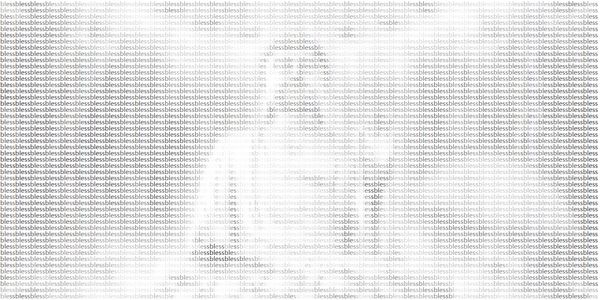

# 赛博上香 CyberBlessing 

Code Buddha bless your project.
--
代码佛祖保佑您项目顺利!
--

一天夜晚，梦见自己的代码被别人删完了，夜里直接惊醒。

之后一直后怕，直到高人求助，贴上代码佛祖，项目果然上线，老天保佑！

---
One night, I dreamt that my code had been deleted by others, and I woke up directly at night. 

After that, I was afraid until the master asked for help and affixed the code Buddha, the project was really online, Buddha bless!

---

# 用到的网站 Possible Wedside 
1. 字母生成 http://patorjk.com/software/taag
2. 绘图板 http://asciiflow.com/
3. 输入图片生成 http://sourceforge.net/projects/ascgen2/files/ 

# 如何使用 How to use 

~~~
Copy code to a Inconspicuous place and comment that
~~~

~~~
复制到您的项目，然后注释掉他
~~~

# 欢迎最会整活的你 Welcome to your PR 

有好活欢迎投稿，集万家之大成，各方神仙Buff叠满！

PS：无亵渎之意，还请多多包涵！